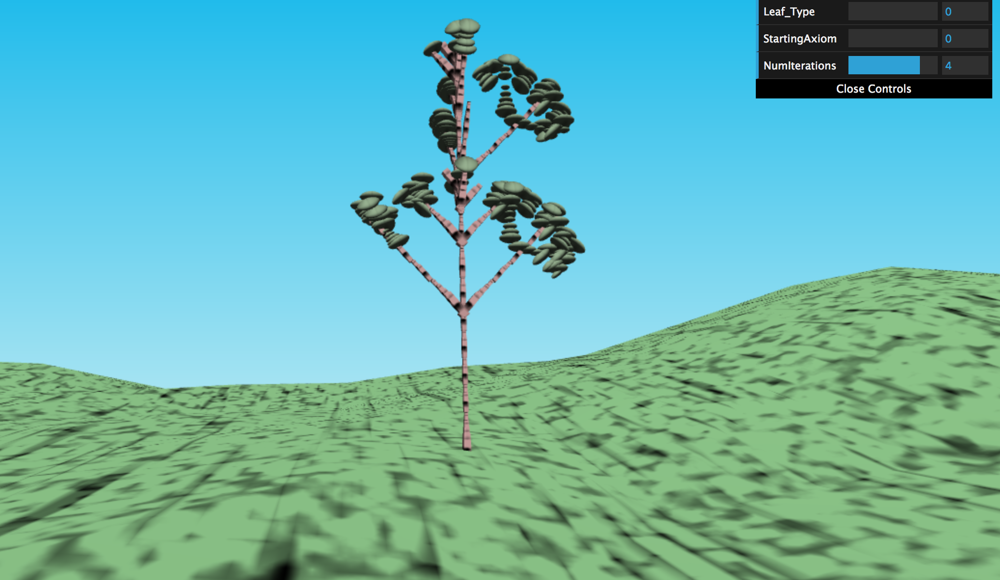
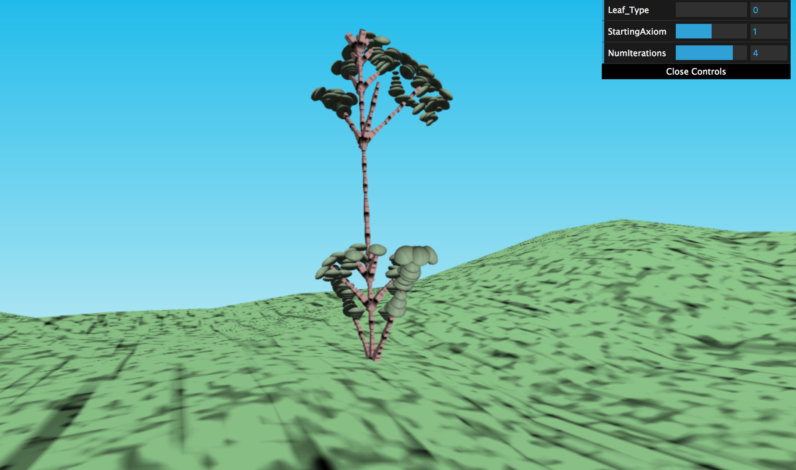
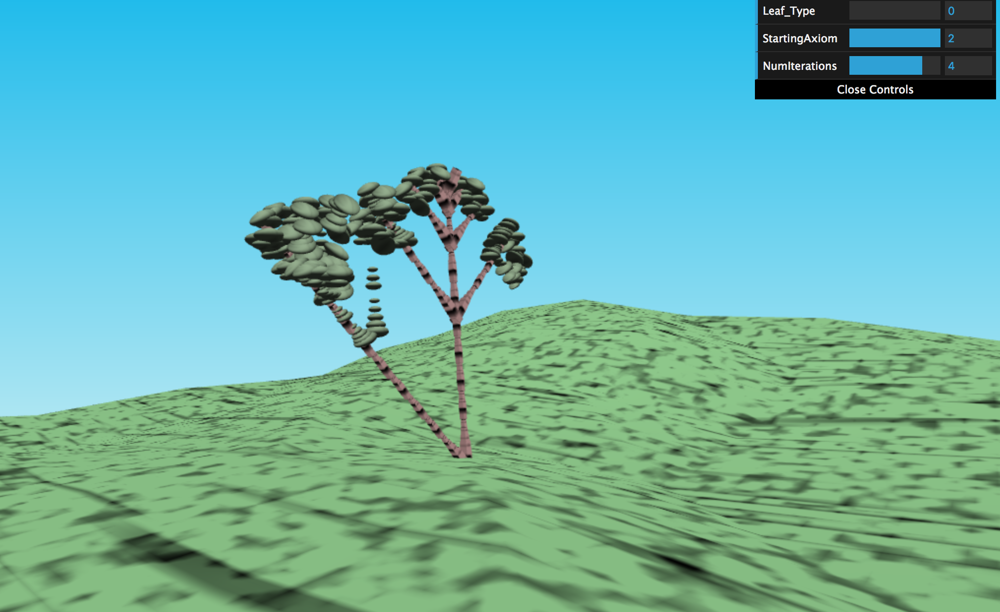
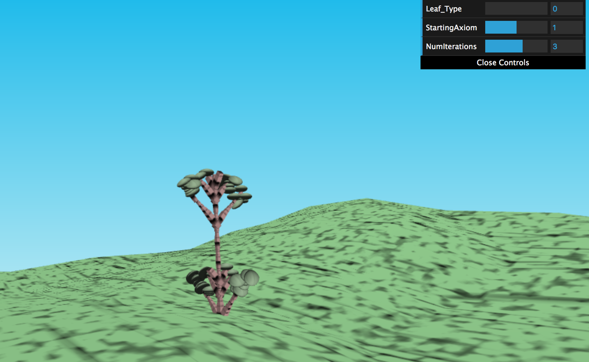

# hw04-l-systems

Evelyn Bailey

ebail

Project: https://eviebail.github.io/hw04-l-systems/

Website: https://evelyn.pb.studio

Features:

System Architecture:

Turtle: The turtle class keeps track of the position, orientation, and depth of each object placed in the scene. The orientation is used to rotate the geometry in the same orientation as the forward vector of the Turtle. The depth is used to place leaves instead of branches after a certain depth.

TurtleHistory: A stack of turtles that is used to save and remove turtles from the system. This allows the branching effect to be achieved where there are multiple branching paths from the same position. When the "[" character is reached, a turtle is saved to the stack with the previous turtle's position and orientation and its depth + 1. When the "]" character is reached, the most recent turtle is removed from the stack and the program continues from the previous turtle.

Axiom and Grammar: The axiom is the starting string, which is used to iteratively expand the grammar, or the string that is used to place objects in the scene, using the ExpansionRule class.

ExpansionRule: This class maps an input character to a set of possible strings it could expand to. For instance, whenever an X character is reached, the ExpansionRule class returns a map to two sets of strings, each with a probability associated with it. This probability is used to determine which rule to select with what frequency.

DrawingRule: This class, similar to ExpanisionRule, maps an input character to a set of functions that the turtle can perform when that character is read based on some built-in probability. This controls the turtle's movements and orientation.

LSystem: This class is a wrapper class to use each of the aforementioned classes to generate a tree. It first takes the axiom and expands it by accessing the set of rules from its ExpansionRule class for the entire string for a set number of iterations. Once the grammar is built, it then uses the TurtleHistory class to perform the drawing rule selected for each character of the grammar. The turtle's position, orientation, and scale is saved and returned when main calls LSystem's runSystem function.

Main: Main sets up the mesh assets, runs the LSystem, and takes LSystem's output and passes the information to the VBO. In the VBO, a Translation/Rotation/Scale matrix based on the position/orientation/scale of each turtle is assembled and applied to the vertices of the geometry. A gradient is used for the sky color in a separate fragment shader, and the geometry is shaded using Fractal Brownian Motion (FBM).

A Note on Rendering: This project uses instanced rendering, where a mesh or object is created once and drawn multiple times. This is accomplished by keeping track of the number of instances to be drawn and setting up instanced variables like vs_Translate and vs_Scale that have a separate value for each instance of the object.

Customizations:

There are three aspects you can change about the tree. 1. You can animate the tree by toggling Leaf_Type. A vertex deformation is applied to the leaves' position using a sin function. A type vector is passed to the shader to distinguish between the branches and leaves. 2. You can also modify the starting axiom by toggling StartingAxiom. It shows how the resulting tree can change based on the original string that is used to expand into a grammar. 3. Finally, you can see the growth of the tree using the NumIterations option. This changes how many iterations the LSystem will expand the grammar based on the expansion rules.

Sample Images:

Tree with the first axiom, FXX: 

Tree with the a modified axiom, XFX:

Yet another modified axiom example, [-FX]FX:

Tree with 3 iterations instead of 4:

